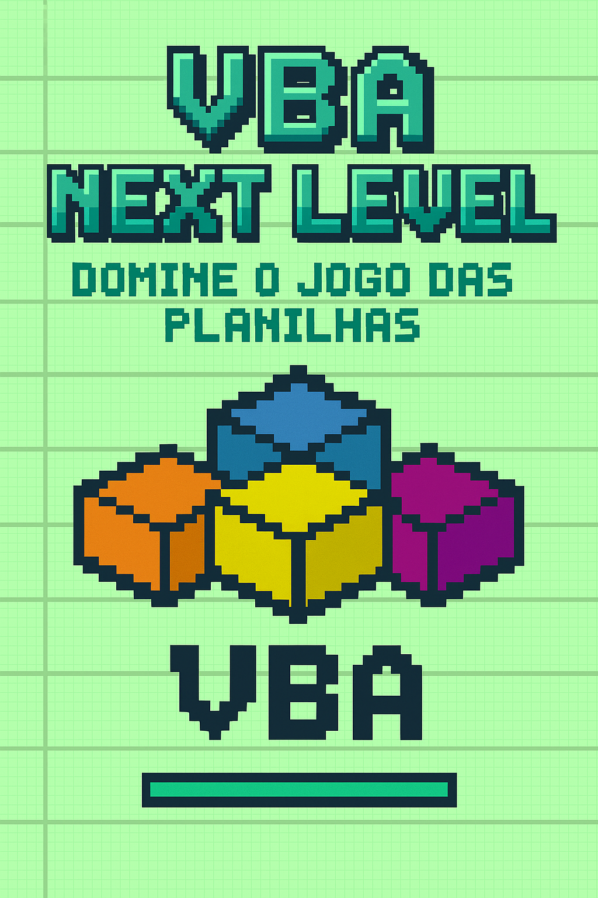

-------

# Projeto EBOOK Gerado por I.A.s

Projeto com o objetivo de gerar um ebook digital com as facilidades das ferramentas de IA. todos os prompts
seguem abaixo.

<a href="https://github.com/NayaMicheletti/ebook-create/blob/main/output/E-Book%20-%20VBA%20Next%20Level.pdf" title="View PDF now"> 📕Clique aqui para ler</a>

## 💻 Tecnologias utilizadas no projeto

- [ChatGPT](https://chat.openai.com/) 
- [Canva](https://www.canva.com/)

## 🧠 Prompts

ChatGPT：

|   Ação   | prompt                                                                                                                                                                                                                                                                         |
| :------: | ------------------------------------------------------------------------------------------------------------------------------------------------------------------------------------------------------------------------------------------------------------------------------ |
|  título  | Crie um título de um ebook sobre o tema de VBA, o ebook é do nicho de Excel e o subnicho é de VBA, o título deve ser épico e curto, e tenha uma temática gamer no título, me liste 5 variações de títulos                                                       |
| conteúdo | Crie um eBook introdutório sobre VBA, com linguagem leve, divertida e didática. O público-alvo são iniciantes que querem automatizar tarefas no Excel. O eBook deve conter introdução, 6 capítulos, conclusão e “sobre mim”, com explicações simples e exemplos de código em contextos reais.
Os capítulos devem ter entre 1 e 2 páginas e títulos curtos e criativos (ex: Desbloqueando o poder do VBA, Variáveis e decisões inteligentes). O texto deve parecer uma conversa, evitando travessões e frases longas, sempre com um toque motivacional no fim de cada capítulo. Os blocos de código devem ser funcionais e seguros, usando boas práticas como Set ws = Sheets("...") quando necessário.
O “Sobre mim” deve ser escrito em primeira pessoa, com tom leve e pessoal, explicando que o livro foi criado de forma independente durante o curso de Fundamentos de IA Generativa da DIO, destacando a paixão por automação e o desejo de facilitar o trabalho de outras pessoas com VBA. |
| Capa | Gere uma imagem com as seguintes instruções: A capa apresenta um design digital minimalista com estética retrô inspirada em jogos 8/16 bits. Na parte superior, o título “VBA Next Level” aparece em letras grandes e quadradas, com gradiente verde-azulado e sombras que lembram os logotipos pixelados de games antigos. Logo abaixo, o subtítulo “Domine o Jogo das Planilhas” está escrito em verde turquesa, também em estilo pixel art, mantendo o ar gamer. Ao centro, há um ícone do VBA reinterpretado como símbolo pixelado, composto por cubos que formam a estrutura do icone. O fundo é verde claro, com linhas sutis que lembram planilhas do excel, dando uma sensação tecnológica e de profundidade. O conjunto transmite a ideia de primeiro nível de um jogo de programação, equilibrando nostalgia e modernidade, ideal para um eBook de introdução ao VBA. |

## ✨ Features

- Conteúdo e Imagem gerados via ChatGPT

## 📚 Materiais

- Imagens utilizadas em `assets`
- ebook gerado durante as aulas em `output`

